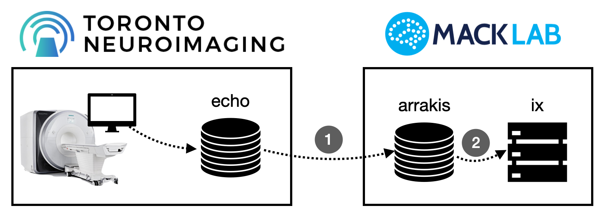
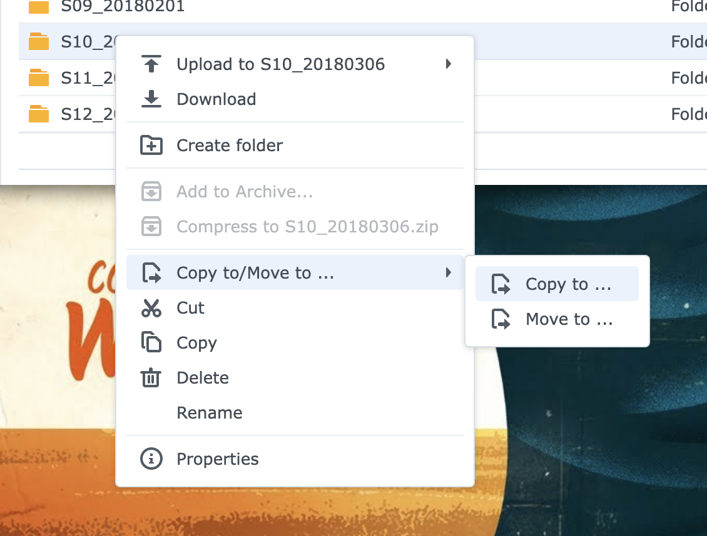
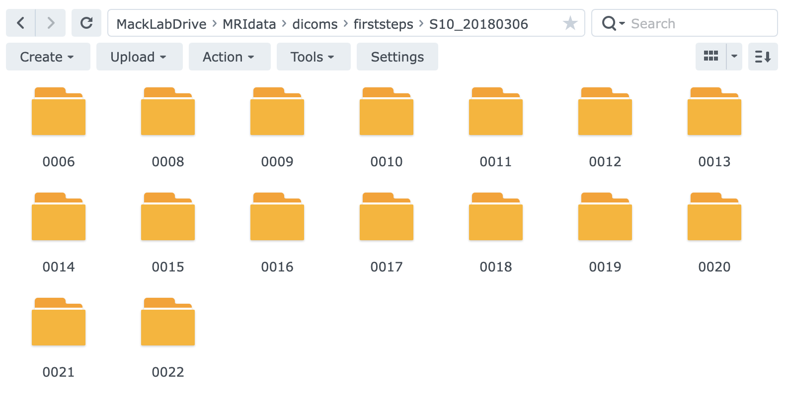
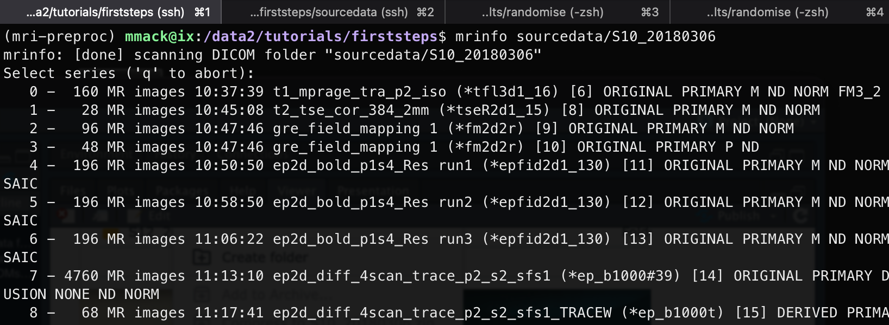
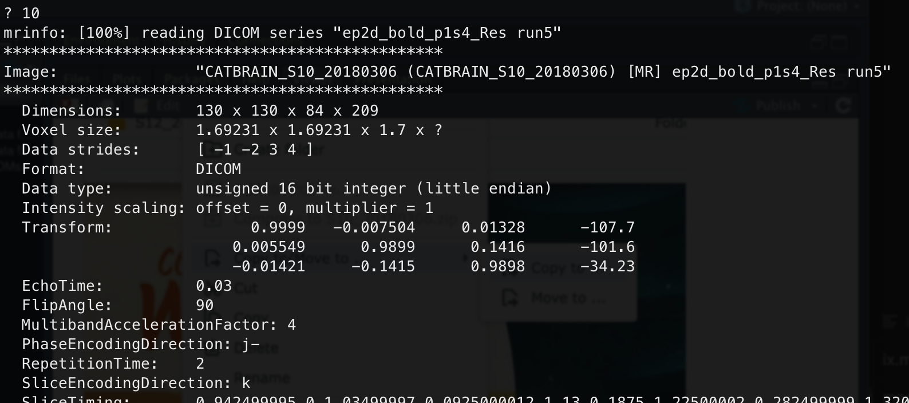
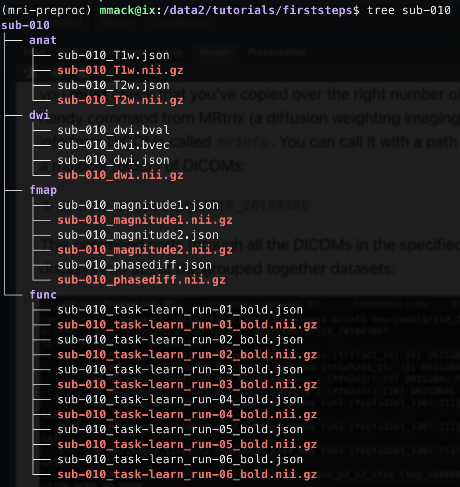
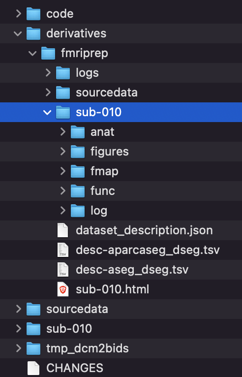

# First steps in data processing

Congratulations, you collected your first MRI scan! Now what? This tutorial walk through some of the very first steps of transferring and processing your MRI data. First, let's talk about our setup:

Data generated at ToNI is first reconstructed and stored on the scanner control computer. It is then internally copied to ToNI's file server which is named echo. We have to retrieve this data to put on our computer systems: arrakis, the lab data backup NAS; and ix, our computation server. I've made this a two-step process to ensure data backup and integrity, first copying from echo to arrakis, then second, copying from arrakis to ix.

## Transfer data from ToNI's echo to arrakis

Before we transfer data, let's talk about the data itself.

> Our scanner outputs DICOM images. DICOM is a standard medical image format (first released in 1985!) that consists of meta information in a header block and the actual image data. The header information allows for multiple images to be grouped into different datasets and volumes within datasets. It is super flexible, but actually not that usefulor efficient for the type of analyses we like to perform. We will get back to this in a later step. Our scanner outputs DICOMs on a slice-by-slice or volume-by-volume basis. For most anatomical scans, you will find a separate DICOM file for each slice of each scan. If you have a T2 anatomical scan that consists of 42 slices, you should expect the scanner to output 42 DICOM files for that specific scan. For BOLD data, you typically get one DICOM file for each volume collected (e.g., you collect 142 time points, you have 142 DICOMs).

We need the DICOMs on echo on our computer systems. I prefer to transfer data from echo to arrakis through arrakis' web interface (i.e., webterface). If you are on the Mack Lab network or connected via VPN, you can log in to [arrakis.mack.psych.utoronto.ca](arrakis.mack.psych.utoronto.ca:5000) and pull up File Station. First, In the left side under the SFTP heading, you'll find a link named "echo (mackmicha\@....". Clicking that will log into echo and give you access to the DICOMs we have collected at ToNI. Data from a ToNI session is stored in the corresponding project directory (e.g., CATBRAIN/S10_20180306). Once you've found your session directory, right click on it and select "Copy to...":

{width="526"}

In the window that pops up, select Arrakis/MackLabDrive/MRIdata/dicoms/\<your project\>. If you haven't yet created a project folder here, you can click the create folder button and make one. Copying the data will take awhile! One session is often multiple GBs of data. Once it is done copying, you should find in the specified location on arrakis several folders (one for each scan) that each contain multiple DICOM files. Success!

{width="782"}

## Transfer data from arrakis to ix

Before we can transfer the dicoms to ix, we need to do some setup on ix. First log into ix using SSH in Terminal/iTerm/Command Prompt on your local machine:

`$ ssh -XY <username>@ix.mack.psych.utoronto.ca`

We have a conda environment (mri-preproc) that includes all the apps and scripts we need for initial processing. Activate it!

`$ conda activate mri-preproc`

Create a project folder and change into it:

`$ mkdir -p /data2/tutorials/firststeps`

`$ cd /data2/tutorials/firststeps`

Then, create a BIDS-formatted directory structure. Luckily, there's a handy script for this:

`$ dcm2bids_scaffold`

This script will create all the necessary folders and files for a valid BIDS directory. You can now modify these files and add to the folders, which we will do right away! Let's copy over the DICOMs on arrakis to our new ix project folder. The scaffold script above creates a folder named `sourcedata`, this is where we want to put the DICOMs. Arrakis is remotely mounted on ix, so we can easily copy over the data:

`$ cp -r /mnt/arrakis/MRIdata/dicoms/firststeps/S10_20180306 sourcedata/.`

Again, this will take a few minutes (remember, lots of data here). Once it is done, you [**must**]{.underline} check that you've copied over the right number of files. There's a very handy command from MRtrix (a diffusion weighting imaging toolbox) for pulling info from DICOMs called `mrinfo`. You can call it with a path to a folder containing a multiple folders of DICOMs:

`$ mrinfo sourcedata/S10_20180306`

This command sorts through all the DICOMs in the specified directory and displays info about the grouped together datasets:

You can quickly check that you've copied over all the scans you were expecting and that you have the correct number of DICOMs for each scan. If you want to know more about a specific scan, type in the scan number (listed in the far left column) at the prompt:

## Convert DICOMs to BIDS-format Nifti files

As noted above, DICOMs don't suffice for our analysis pipelines. We need to convert the DICOMs into Nifti files. And, we need to organize our participants' data into BIDS format. Again, luckily, there's a command for that! It is called `dcm2bids`. This command requires several inputs, many of which don't change across participants. To ensure that I don't mistakenly change or omit one of these inputs, I use a wrapper script which is found on ix here: `/data2/tutorials/firststeps/code/run_dcm2bids.sh`.

The tricky part of dcm2bids is defining a configuration file. This file tells dcm2bids how to find your different scans and organize them into their appropriate folders. To be honest, this is a bit of a mess. It relies on defining patterns for identifying scans based on their filenames and header information. For a more thorough explanation, check out [Andy's Brain Book section on dcm2bids](https://andysbrainbook.readthedocs.io/en/latest/OpenScience/OS/BIDS_Overview.html#understanding-dcm2bidss-configuration-file).

Once you have your configuration file created (and I would highly recommend modifying one that works for a different dataset), you can run `dcm2bids` with the `run_dcm2bids.sh` script by providing both path to the participant's dicoms and the participant code:

`$ code/run_dcm2bids.sh sourcedata/S10_20180306 010`

Once finished, you'll find a new participant directory that includes all the nifti files (file extension .nii.gz) for the different scans organized into BIDS specific directories:

{width="479"}

## Update JSON sidecar files to link fieldmaps to BOLD

You may have noticed that every nifti file above has a corresponding file ending in .json. These are JSON sidecar files that include all the header information for the DICOM files. Nifti files great for our type of analyses, but the Nifti format doesn't have nearly as much header information as the DICOM format. Thus, when we convert from DICOM to Nifti, we lose a lot of important header info. `dcm2bids` is smart enough to dump that information into these JSON sidecar files. And, BIDS format requires these sidecar files exist and are appropriately formatted.

We need to update one field in JSON sidecar files for the fieldmaps that links them to the BOLD scans. We collect fieldmaps to correct for inhomogeneities in the magnetic field that impact BOLD measures. fmriprep and other BIDS-compliant apps can automatically perform this correction, but we need to specify which BOLD scans go with the fieldmaps with the IntendedFor field (check out that link to Andy's Brain Book above to learn more about this). I wrote a script that does this, just pass it the participant number:

`$ code/update_json.sh 010`

## Run fmriprep

Now we are ready to run fmriprep! Like dcm2bids, fmriprep has many inputs, many more in fact. To reduce errors and improve reproducibility, I created a wrapper script found here: `/data2/tutorials/firststeps/code/run_fmriprep.sh`.

> fmriprep is very flexible and has many options. The parameters in my wrapper script are quite general and really shouldn't be considered a one-size-fits-all solution. If you use this script, make sure to update it to include the options you need for your project.

To run fmriprep, call the run script noted above with the participant number:

`$ code/run_fmriprep.sh 010`

Once it is finished (on ix this takes about 7 hours per participant when using 10 threads), you'll find the results in the derivatives folder:

{width="250"}

## Recap

At this point, you've managed to transfer and convert DICOMs and perform minimal preprocessing for one participant. Woohoo! Now, repeat this for all of your participants. These first steps of an MRI pipeline have been designed for:

1. **Data integrity** - Multiple copies of raw data are stored in multiple locations (echo, arrakis, and an automatic backup of arrakis on the department's central backup server)

2. **Analytic consistency and reproducibility** - Creating wrapper scripts for each step (dcm2bids, updating JSON files, fmriprep) ensures the same processing is performed for each participant.

3. **Processing QC** - Each step offers a point to ensure data transfer and processing are correct. Checking file counts and sizes, quickly analyzing DICOM contents with `mrinfo`, and visual checks on outputs are key, but you have to remember to do it for every participant!
